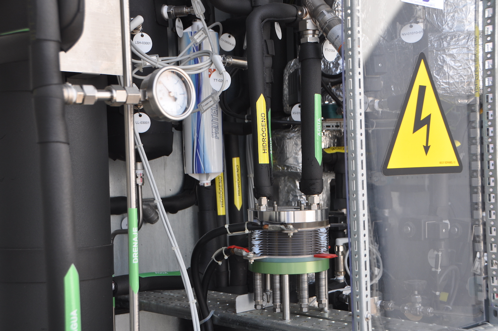

## Una visión general de la planta

La planta piloto de cogeneración se ha ejecutado en las instalaciones de la Escuela Superior de Enseñanzas Técnicas de la Universidad CEU Cardenal Herrera (UCHCEU) en Valencia[^2]. 

En la siguiente imagen se muestra la construcción de la planta, integrada en la zona de instalaciones de la vivienda SMLsystem, prototipo de vivienda de consumo de energía casi nulo, presentada por la UCHCEU en 2012 en el concurso internacional Solar Decathlon 2012, presentado en Madrid[^5].

En la imagen se puede ver, de izquierda a derecha, el tanque azul que se utiliza como "buffer" de aceite térmico, el tanque metalizado en el que está contenida y sumergida la pila de combustible y el armario del electrolizador con sus rejillas de ventilación. Cada uno de estos puntos se desarrolla en detalle en los siguientes apartados.

+ [Los fundamenteos de la cogeneración: la cogeneración en detalle](#id_detalle_cog)
+ [La tecnología del hidrógeno: la pila de combustible](#id_fuel_cell)
+ [La producción de hidrógeno verde](#id_hidrogeno)

---

## La cogeneración en detalle

---

## La pila de combustible

## La producción de hidrógeno verde

El electrolizador es un equipo que produce hidrógeno de elevada pureza (99,999%) separando las moléculas de agua mediante una corriente eléctrica. Para estos equipos, igual que para las pilas de combustible, hay diferentes tecnologías. [^1] 

[^1]: La referencia del pie de página es esta
[^2]: Son un rollo las referencias. 
[^5]: Esta es una prueba de la referencia que anoto como 5 y veremos como sale al final en la página web.